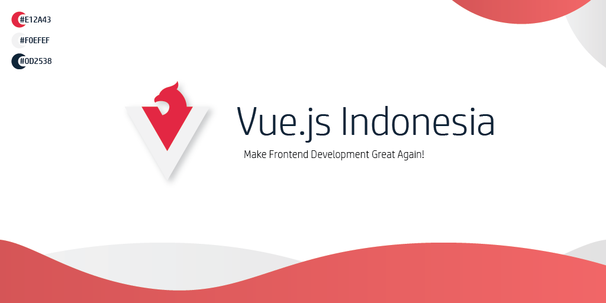

Logo dan assets untuk komunitas Vue.js Indonesia

## Ketentuan Penggunaan Logo

- Tidak diperkenankan menggunakan semua logo yang ada di dalam repository ini untuk kepentingan komersial, 
memproduksi merchandise fisik seperti kaos, baju, stiker dan lainnya, serta alasan lain untuk kepentingan dan keuntungan pribadi tanpa ijin dan sepengetahuan dari beberapa pengurus komunitas Vue.js ID.
- Diperkenankan menggunakan logo untuk kepentingan non-komersial terutama yang berkaitan dengan komunitas teknologi di Indonesia.

## Direktori Logo

```bash
.
├── ai
│   ├── header.ai
│   ├── logo.ai
│   └── wave.ai
├── drawable
│   ├── drawable-hdpi
│   │   ├── logo_circle-black.png
│   │   ├── logo_transparent-glow.png
│   │   └── logo_transparent.png
│   ├── drawable-ldpi
│   │   ├── logo_circle-black.png
│   │   ├── logo_transparent-glow.png
│   │   └── logo_transparent.png
│   ├── drawable-mdpi
│   │   ├── logo_circle-black.png
│   │   ├── logo_transparent-glow.png
│   │   └── logo_transparent.png
│   ├── drawable-xhdpi
│   │   ├── logo_circle-black.png
│   │   ├── logo_transparent-glow.png
│   │   └── logo_transparent.png
│   ├── drawable-xxhdpi
│   │   ├── logo_circle-black.png
│   │   ├── logo_transparent-glow.png
│   │   └── logo_transparent.png
│   └── drawable-xxxhdpi
│       ├── logo_circle-black.png
│       ├── logo_transparent-glow.png
│       └── logo_transparent.png
├── png
│   ├── header_main.png
│   ├── logo_circle-black.png
│   ├── logo_transparent-glow.png
│   ├── logo_transparent.png
│   └── wave.png
└── svg
    ├── header_main.svg
    ├── logo_circle-black.svg
    ├── logo_transparent-glow.svg
    ├── logo_transparent.svg
    └── wave.svg
```

## Pembuat Logo

[@ikrydev](https://github.com/ikrydev) on this [issue #3](https://github.com/vuejs-id/blog/issues/3)

----

Copyright ©️ 2019, Vue.js Indonesia
