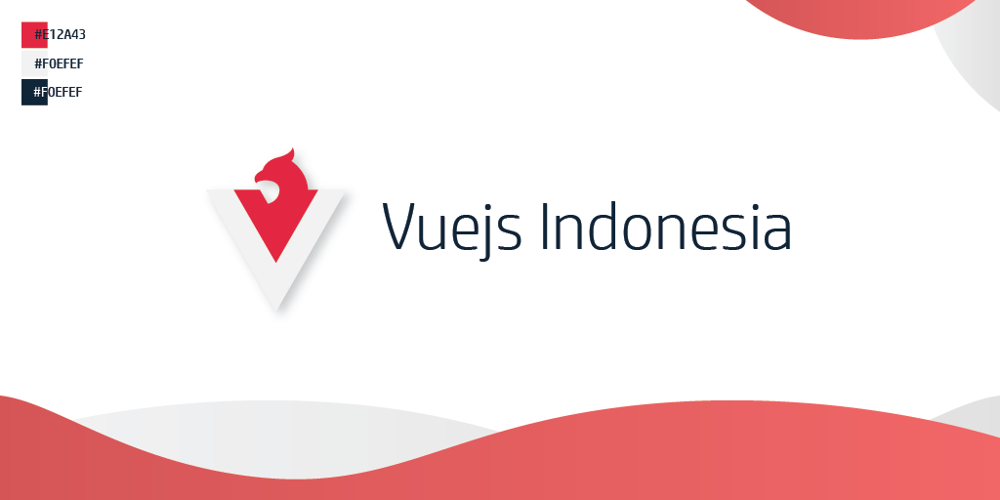

# logo-assets

Logo dan assets untuk komunitas Vue.js Indonesia

## Available logo assets 

```bash
.
├── drawable
│   ├── drawable-hdpi
│   │   ├── logo_circle-black.png
│   │   ├── logo_transparent-glow.png
│   │   └── logo_transparent.png
│   ├── drawable-ldpi
│   │   ├── logo_circle-black.png
│   │   ├── logo_transparent-glow.png
│   │   └── logo_transparent.png
│   ├── drawable-mdpi
│   │   ├── logo_circle-black.png
│   │   ├── logo_transparent-glow.png
│   │   └── logo_transparent.png
│   ├── drawable-xhdpi
│   │   ├── logo_circle-black.png
│   │   ├── logo_transparent-glow.png
│   │   └── logo_transparent.png
│   ├── drawable-xxhdpi
│   │   ├── logo_circle-black.png
│   │   ├── logo_transparent-glow.png
│   │   └── logo_transparent.png
│   └── drawable-xxxhdpi
│       ├── logo_circle-black.png
│       ├── logo_transparent-glow.png
│       └── logo_transparent.png
├── header.ai
├── header_main.png
├── logo.ai
├── logo_circle-black.png
├── logo_transparent-glow.png
├── logo_transparent.png
└── svg
    ├── logo_circle-black.svg
    ├── logo_transparent-glow.svg
    └── logo_transparent.svg
```

## Logo creator

[@ikrydev](https://github.com/ikrydev) on this [issue #3](https://github.com/vuejs-id/blog/issues/3)

----

Copyright ©️ 2019, Vue.js Indonesia
